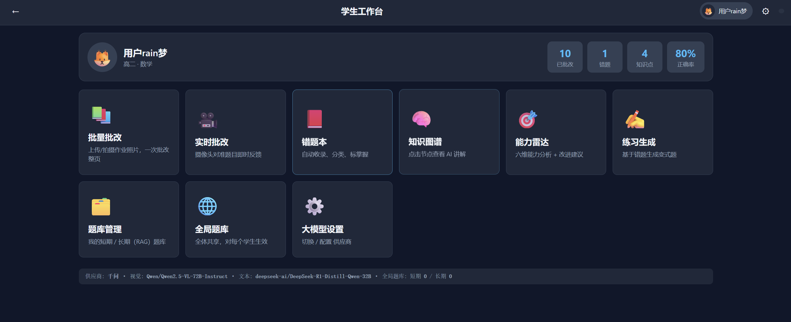
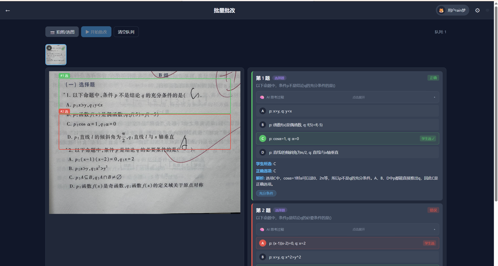
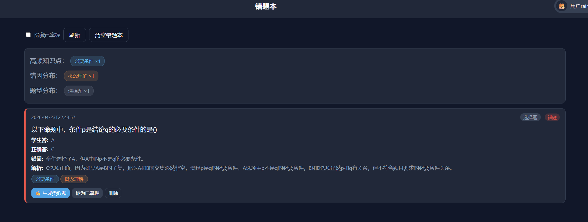
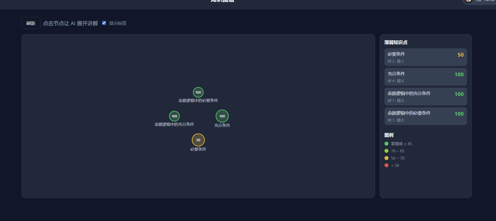
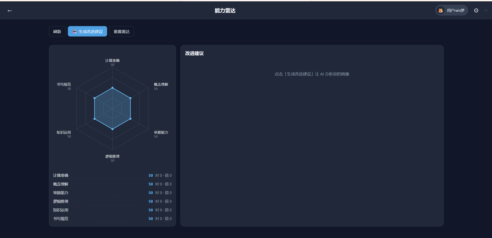
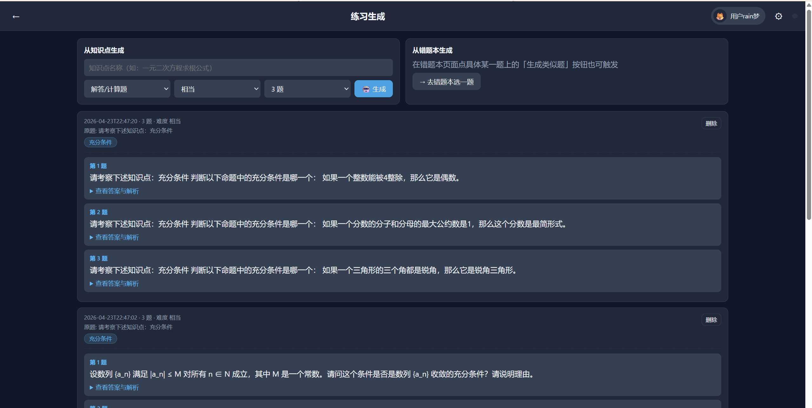
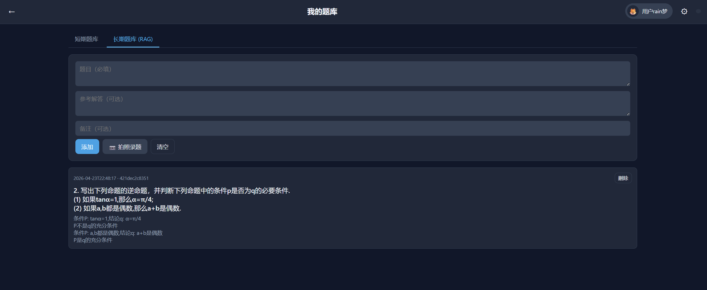
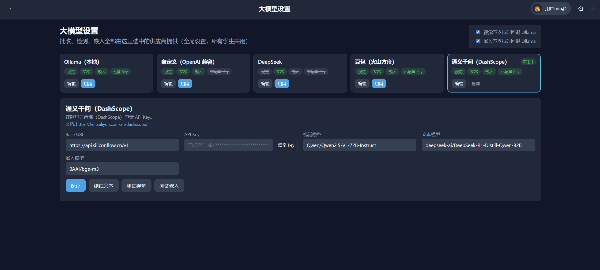

# 作业辅助工具

基于 Ollama / DeepSeek / 豆包 / 千问 的智能作业批改系统。

## 图片演示

















## 亮点

| 功能 | 说明 |
|---|---|
| 多身份 | 每个学生一个独立档案，头像 / 姓名 / 年级 / 学科 |
| 自动错题本 | 批改时 `is_correct=false` 自动归档，带 AI 抽取的知识点与错因标签，可标「已掌握」 |
| 变式题生成 | 基于单道错题或任一知识点，让 AI 生成 2–8 道同类型同知识点的练习（带答案与解析） |
| 能力雷达 | 六维（计算准确 / 概念理解 / 审题能力 / 逻辑推理 / 知识运用 / 书写规范），AI 生成改进建议 |
| 知识图谱 | 力导向可视化，颜色反映掌握度，点击节点让 AI 现场讲解（Markdown） |
| 全局题库 | 短期 + 长期(RAG) 两层题库对**所有学生共用**，叠加到每个学生自己的题库上 |
| 强化识别 | 针对中文密排填空/选择混合页，检测失败会自动重试并识别；实在失败也会清晰提示而不是显示乱码 |

## 架构

```
┌────────────────────────────────────────────────────────┐
│                  前端 (静态文件)                         │
│  index.html + app.js + style.css  (原生 JS / SVG)      │
│  视图：学生选择 / 仪表盘 / 批改 / 错题本 / 知识图谱 /    │
│       雷达 / 练习 / 题库 / 设置                         │
└───────────────────────┬────────────────────────────────┘
                        │ REST
┌───────────────────────▼────────────────────────────────┐
│                 FastAPI 后端 (main.py)                  │
├────────────────────────────────────────────────────────┤
│ student_manager  学生CRUD, 档案目录, 历史记录             │
│ grader           批改 + 自动抽取知识点/错因 + 归档        │
│ error_book       错题本（按学生）                        │
│ knowledge_graph  知识图谱 + AI 讲解                     │
│ ability_analyzer 六维雷达 + AI 改进建议                  │
│ problem_generator 基于错题/知识点生成变式题              │
│ short_term_bank  短期题库（按学生）                      │
│ rag_system       长期题库 / ChromaDB（按学生 collection）│
│ question_detector / image_utils / llm_providers / ...   │
└────────────────────────────────────────────────────────┘
                        │
            ┌───────────┴───────────┐
            │      LLM 供应商         │
            │  Ollama（默认本地）      │
            │  		    DeepSeek    │
            │  豆包 / 千问     	      │
            └───────────────────────┘
```

### 数据目录

```
data/
├─ students_index.json       全体学生概要
├─ llm_config.json           LLM 供应商配置
├─ app.log                   应用日志
├─ global_short_term.json    【全局】短期题库（所有学生共用）
├─ avatars/                  用户上传的头像图片
├─ chroma_db/                ChromaDB
│    ├─ long_term_global     【全局】长期题库（所有学生共用）
│    └─ student_{sid}        每学生一个 collection
└─ students/
   └─ {sid}/
      ├─ short_term.json     该学生自己的短期题库
      ├─ errors.json         错题本
      ├─ knowledge.json      知识图谱（节点 + 关系）
      ├─ ability.json        能力雷达原始数据
      ├─ history.json        历史批改记录（用于统计）
      └─ generated.json      AI 生成的练习批次
```

**两层题库的合并逻辑**：
- 短期题库：批改时 prompt 里会同时注入【全局】+【该学生】两段内容
- 长期题库：检索时同时查全局 collection 和该学生 collection，按相似度合并 top_k

## 快速开始

### 1. 安装依赖

```bash
pip install -r requirements.txt
```

### 2. （可选）安装 Ollama 和模型

本地零成本方案。装好 [Ollama](https://ollama.com) 后：

```bash
ollama pull llava:7b          # 视觉模型（批改题目）
ollama pull nomic-embed-text  # 嵌入模型（长期题库）
```

如果你有 API Key 想直接用云端（豆包 / 千问等），跳过此步，在首页设置里填 Key 即可。

### 3. 启动

```bash
python main.py
```

浏览器打开 `http://localhost:8000`

手机（同局域网）打开 `http://<电脑 IP>:8000`

## 使用流程

1. **第一次启动 → 学生选择页** 没有学生时点「+ 添加学生」，填姓名、年级、学科，可选头像（emoji 或上传图片）
2. **进入学生仪表盘** 顶部是 8 个功能入口，底部状态栏显示当前 LLM 供应商
3. **批量批改** 拍照或选图 → 识别题目 → 一键批改 → 错题自动归档，错题本/知识图谱/雷达同步更新
4. **错题本** 按时间倒序排列，带 AI 抽取的知识点标签；点「 生成类似题」可一键生成变式
5. **知识图谱** 力导向布局，点任意节点让 AI 现场讲解（5 个结构化章节：定义/要点/例题/易错/建议）
6. **能力雷达** 六维可视化，点「 生成改进建议」让 AI 输出针对性的一周行动计划

## API 路径总览

### 全局（与学生无关）

| Method | Path | 说明 |
|---|---|---|
| GET | `/api/health` | 健康检查 + LLM 状态 |
| GET/PUT | `/api/llm_config` | 读取/更新 LLM 设置 |
| POST | `/api/llm_config/test` | 测试供应商连通性 |
| POST | `/api/detect` | 只识别题目不批改 |
| POST | `/api/extract_for_bank` | 从图片提取一道题 |
| GET/DELETE | `/api/logs` | 日志 |

### 全局题库（所有学生共用）

| Method | Path | 说明 |
|---|---|---|
| GET / POST | `/api/global/short_term` | 全局短期题库 |
| DELETE | `/api/global/short_term/{id}` | 删 |
| DELETE | `/api/global/short_term` | 清空 |
| GET / POST | `/api/global/rag` | 全局长期题库 |
| DELETE | `/api/global/rag/{id}` | 删 |
| DELETE | `/api/global/rag` | 清空 |

### 学生档案

| Method | Path | 说明 |
|---|---|---|
| GET | `/api/students` | 所有学生（含统计） |
| POST | `/api/students` | 创建 |
| GET / PUT / DELETE | `/api/students/{sid}` | 详情 / 更新 / 删除 |
| POST | `/api/students/{sid}/avatar` | 上传头像 |

### 按学生的资源（所有下列路径都带 `/api/students/{sid}` 前缀）

| Method | Path 后缀 | 说明 |
|---|---|---|
| POST | （根级）`/api/grade` + `student_id` 表单 | 批改（会自动写入该学生错题本等） |
| POST | （根级）`/api/realtime` + `student_id` 表单 | 实时批改 |
| GET/POST/DELETE | `/errors` , `/errors/{id}` | 错题本 |
| PUT | `/errors/{id}/mastered` | 标已掌握 |
| GET/DELETE | `/knowledge` | 知识图谱 |
| GET | `/knowledge/{name}/explain` | AI 讲解某知识点 |
| GET/POST/DELETE | `/ability` , `/ability/advice` | 雷达 + 建议 |
| GET/POST/DELETE | `/practice` | 练习生成 |
| POST | `/practice/from_error` | 基于错题生成 |
| POST | `/practice/from_kp` | 基于知识点生成 |
| GET/POST/DELETE | `/short_term` , `/rag` | 短期/长期题库 |
| GET | `/history` | 历史批改记录 |

## 能力雷达六维

| 维度 | 侧重 |
|---|---|
| 计算准确 | 算术运算是否正确 |
| 概念理解 | 对概念/定义是否理解到位 |
| 审题能力 | 是否看清题意 |
| 逻辑推理 | 推理步骤是否严密 |
| 知识运用 | 能否调用相关知识 |
| 书写规范 | 格式/步骤/书写是否规范 |

批改每道题时，后端会额外调用一次**文本** LLM，为每题抽取：
- 1~3 个**知识点**（用于知识图谱与错题本标签）
- 若做错，标 1~3 个**错因维度**（用于雷达）

一次批改只会多一次文本 LLM 调用（整批一次性抽），对性能影响很小。

## 开发者说明

### 扩展能力维度

修改 `config.py` 的 `ABILITY_DIMENSIONS`，前端会自动适配多边形边数。
旧数据里缺失的维度会在首次加载时自动补 0/0。

### 切换供应商

所有学生共享同一套 LLM 设置。页面右上角齿轮 →「大模型设置」即可切换。
如果某供应商不支持视觉或嵌入（例如 DeepSeek），可在设置里打开「回退到 Ollama」。

### 数据迁移

- v2 的 `data/short_term_bank.json`（单文件）不会自动迁移。有需要的话，新建一个学生后，把内容手动粘贴进该学生的短期题库即可。
- v2 的 `chroma_db` collection 名为 `long_term_questions`，v3 按 `student_{sid}` 分。旧数据不会被 v3 读取，可保留或删除。

## 识别不准怎么办

如果你拍的是"满页小字+填空+选择"的中文作业页，出现**整页被识别为一道题**或右侧结果卡显示乱码，多半是**视觉模型能力不足**。建议：

1. 在右上角齿轮 →「大模型设置」切换到更强的视觉模型：
   - **千问**：`qwen-vl-max`
   - **豆包**：`doubao-1.5-vision-pro` / `doubao-seed-1-6`
2. 拍照技巧：整页充满画面、避免反光、光线充足；最好把书压平
3. 系统本身已内置两次重试 + 中文填空自动纠正，若最终仍失败会显示清晰的黄色「识别失败」卡片，**不会**再把乱码塞给你

## 兼容性

- Python 3.10+
- 浏览器：Chrome / Edge / Safari / 移动端浏览器（用到 getUserMedia，实时模式需 HTTPS 或 localhost）
- 后端默认绑定 `0.0.0.0:8000`，可在 `config.py` 改

---

本项目使用AI进行辅助开发, 存在开源模型的产出代码
